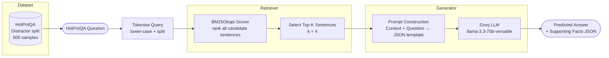

# Pipeline 1 — Vanilla RAG (BM25 Sparse Retrieval)

---

## 1. Architecture Diagram



**Linear pipeline — no feedback loop.**

```
Question ──→ BM25 Retrieve (top-k) ──→ Prompt ──→ LLM ──→ Answer + Supporting Facts
```

---

## 2. Explanation and Working

### Overview

Vanilla RAG is the **baseline pipeline** and implements the simplest possible Retrieval-Augmented Generation strategy. It relies entirely on **BM25** — a classical sparse, keyword-based retrieval algorithm — to find the most relevant sentences from a fixed candidate pool, before passing them to an LLM for answer generation. No neural embeddings, no graph structures, and no multi-stage refinement are involved.

### Step-by-Step Working

1. **Data Loading**  
   The HotPotQA `distractor` validation split is loaded. Each sample contains a multi-hop question, a set of 10 paragraphs (2 gold + 8 distractors), gold supporting sentences, and a gold answer. 500 samples are randomly selected with a fixed seed (`SEED=42`).

2. **Context Flattening**  
   Each sample's context (list of `(title, sentences[])` pairs) is flattened into a list of individual candidate sentences, each annotated with its paragraph title and sentence index (`sent_id`). A typical sample yields ~40–60 candidate sentences.

3. **BM25 Retrieval**  
   All candidate sentences are tokenised (lower-cased, whitespace split) and indexed using `BM25Okapi`. The query (question) is tokenised the same way, and BM25 scores every candidate. The **top-K** (K=4) highest-scoring candidates are returned.

4. **Prompt Construction**  
   The top-K retrieved sentences are formatted into a structured prompt. Each sentence is numbered `[i]` with its paragraph title, sentence ID, and text. The prompt instructs the LLM to answer using **only** the provided context and to emit **valid JSON** with `answer` and `supporting_facts` fields.

5. **LLM Generation**  
   The prompt is sent to the Groq-hosted `llama-3.3-70b-versatile` model (temperature=0.1, max_tokens=512) via the `GroqClient`. The 14-key API carousel ensures continuous throughput without hitting per-key rate limits.

6. **JSON Parsing**  
   The LLM output is parsed: first as raw JSON, then by extracting a ```` ```json ``` ```` block, and finally by regex-matching `{...}` fallback. If all fail, the answer is recorded as `JSON_PARSE_ERROR`.

7. **Parallel Execution**  
   All 500 samples are processed concurrently via `ThreadPoolExecutor` with 14 workers (one per API key). Results are reordered by original index after completion.

8. **Evaluation**  
   Predicted answers and supporting facts are compared against gold references using the full metric suite (see Section 4).

---

## 3. Components Used

| Component | Details |
|-----------|---------|
| **Dataset** | HotPotQA `distractor` split, validation set |
| **Samples** | 500 (random seed 42) |
| **Retrieval Method** | BM25Okapi (sparse, keyword-based) |
| **BM25 Library** | `rank-bm25` |
| **Tokenisation** | Lower-case + whitespace split |
| **Top-K** | 4 retrieved sentences |
| **LLM** | `llama-3.3-70b-versatile` (Groq) |
| **LLM Temperature** | 0.1 |
| **Max Tokens (generation)** | 512 |
| **API Management** | 14-key carousel with per-key RPM/RPD/TPM/TPD tracking |
| **Concurrency** | `ThreadPoolExecutor`, 14 workers |
| **Rate-limit Buffers** | RPM=25, RPD=900, TPM=10,000, TPD=90,000 |
| **Output Format** | JSON: `{ "answer": "...", "supporting_facts": [{title, sent_id}, ...] }` |
| **Faithfulness Eval** | RAGAS `Faithfulness` metric via `langchain-groq` |

---

## 4. Evaluation Metrics Considered

| Metric | Category | Description |
|--------|----------|-------------|
| **Answer EM** | Answer Quality | Exact string match (normalised) between predicted and gold answer |
| **Answer F1** | Answer Quality | Token-overlap F1 between predicted and gold answer |
| **SP EM** | Retrieval Quality | Exact set match of predicted vs gold supporting facts |
| **SP F1** | Retrieval Quality | F1 over the set of (title, sent_id) supporting fact pairs |
| **SP Precision** | Retrieval Quality | Fraction of predicted SPs that are correct |
| **SP Recall** | Retrieval Quality | Fraction of gold SPs that are predicted |
| **Joint EM** | End-to-End | Answer EM × SP EM |
| **Joint F1** | End-to-End | Answer F1 × SP F1 |
| **RAGAS Faithfulness** | Faithfulness | Fraction of answer claims supported by retrieved context |
| **MRR** | Ranking | Mean Reciprocal Rank of first gold SP in retrieved list |
| **Latency Mean (s)** | Efficiency | Average per-sample wall-clock time |
| **Latency Median (s)** | Efficiency | Median per-sample wall-clock time |
| **Latency p95 (s)** | Efficiency | 95th-percentile per-sample wall-clock time |
| **Cost Proxy Mean** | Cost | Mean weighted token count per sample |
| **Cost Proxy Total** | Cost | Summed weighted token count across all samples |

---

## 5. Formulas

### 5.1 BM25 Scoring

Given a query $Q = \{q_1, q_2, \ldots, q_n\}$ and a document $d$:

$$\text{BM25}(d, Q) = \sum_{i=1}^{n} \text{IDF}(q_i) \cdot \frac{f(q_i, d) \cdot (k_1 + 1)}{f(q_i, d) + k_1 \cdot \left(1 - b + b \cdot \frac{|d|}{\text{avgdl}}\right)}$$

where:
- $f(q_i, d)$ — term frequency of query term $q_i$ in document $d$
- $|d|$ — document length in words
- $\text{avgdl}$ — average document length in the corpus
- $k_1 = 1.5$, $b = 0.75$ (BM25Okapi defaults)
- $\text{IDF}(q_i) = \log\left(\frac{N - n(q_i) + 0.5}{n(q_i) + 0.5} + 1\right)$, where $N$ is the number of documents and $n(q_i)$ is the document frequency of $q_i$

### 5.2 Answer Normalisation

Before computing Answer EM and F1, both predicted and gold answers are normalised:

$$\hat{s} = \text{ws\_join}\left(\text{remove\_punct}\left(\text{remove\_articles}\left(\text{lower}(s)\right)\right)\right)$$

where articles = `{a, an, the}`.

### 5.3 Answer Exact Match (EM)

$$\text{EM}(p, g) = \begin{cases} 1 & \text{if } \hat{p} = \hat{g} \\ 0 & \text{otherwise} \end{cases}$$

### 5.4 Answer F1

Token-level F1 using a bag-of-words overlap:

$$\text{Precision} = \frac{|\hat{P} \cap \hat{G}|}{|\hat{P}|}, \quad \text{Recall} = \frac{|\hat{P} \cap \hat{G}|}{|\hat{G}|}$$

$$\text{F1}(p, g) = \frac{2 \cdot \text{Precision} \cdot \text{Recall}}{\text{Precision} + \text{Recall}}$$

where $\hat{P}$ and $\hat{G}$ are the multi-sets (Counter) of normalised tokens in the predicted and gold answers respectively.

### 5.5 Supporting Facts (SP) Metrics

Let $\mathcal{P} = \{(\text{title}_i, \text{sent\_id}_i)\}$ be the set of predicted supporting facts and $\mathcal{G}$ the gold set:

$$\text{SP Precision} = \frac{|\mathcal{P} \cap \mathcal{G}|}{|\mathcal{P}|}$$

$$\text{SP Recall} = \frac{|\mathcal{P} \cap \mathcal{G}|}{|\mathcal{G}|}$$

$$\text{SP F1} = \frac{2 \cdot \text{SP Precision} \cdot \text{SP Recall}}{\text{SP Precision} + \text{SP Recall}}$$

$$\text{SP EM} = \begin{cases} 1 & \text{if } \mathcal{P} = \mathcal{G} \text{ and } |\mathcal{G}| > 0 \\ 0 & \text{otherwise} \end{cases}$$

### 5.6 Joint Metrics

$$\text{Joint EM} = \text{Answer EM} \times \text{SP EM}$$

$$\text{Joint F1} = \text{Answer F1} \times \text{SP F1}$$

Joint metrics penalise systems that get the answer right but identify the wrong reasoning path, or vice versa.

### 5.7 Mean Reciprocal Rank (MRR)

For a given sample, the reciprocal rank (RR) is computed over the retrieved list of sentences:

$$\text{RR} = \begin{cases} \dfrac{1}{\text{rank}_{\text{first\_gold}}} & \text{if any gold SP appears in retrieved list} \\ 0 & \text{otherwise} \end{cases}$$

$$\text{MRR} = \frac{1}{N} \sum_{i=1}^{N} \text{RR}_i$$

where $\text{rank}_{\text{first\_gold}}$ is the rank (1-indexed) of the first retrieved sentence that matches any gold supporting fact by `(title, sent_id)`.

### 5.8 Cost Proxy

A weighted token count approximating relative API cost based on Groq's Llama-3.3-70B pricing (input: \$0.59/M tokens, output: \$0.79/M tokens, ratio ≈ 1.34×):

$$\text{Cost Proxy} = T_{\text{input}} + 1.34 \times T_{\text{output}}$$

$$\text{Cost Proxy Mean} = \frac{1}{N} \sum_{i=1}^{N} \text{Cost Proxy}_i$$

### 5.9 RAGAS Faithfulness

RAGAS Faithfulness measures what fraction of the claims in the generated answer can be inferred from the retrieved context. The metric uses an LLM as a judge:

$$\text{Faithfulness} = \frac{\text{Number of claims in answer supported by context}}{\text{Total number of claims in answer}}$$

A claim is considered supported if the LLM judge determines it can be inferred from at least one sentence in the retrieved context.
