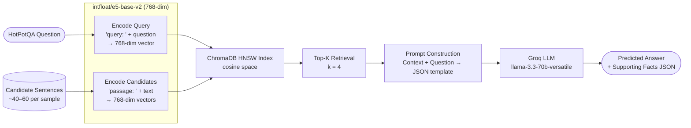

# Pipeline 2 — Single-Stage RAG (Dense / ChromaDB Retrieval)

---

## 1. Architecture Diagram



**Single-pass dense retrieval — no feedback loop.**

```
Question ──→ Dense Embed ──→ ChromaDB Search (top-k cosine) ──→ Prompt ──→ LLM ──→ Answer
```

---

## 2. Explanation and Working

### Overview

Single-Stage RAG replaces the keyword-based BM25 retriever of Vanilla RAG with a **neural dense retriever**. Each sentence and the query are mapped to a continuous 768-dimensional embedding space using the `intfloat/e5-base-v2` encoder. Similarity is computed via **cosine distance** in a ChromaDB HNSW index. The top-K most semantically similar sentences are passed to the LLM. There is still no iterative refinement — retrieval happens once.

### Step-by-Step Working

1. **Data Loading**  
   Same as Vanilla RAG: 500 HotPotQA `distractor` validation samples, random seed 42.

2. **Context Flattening**  
   Each sample's context is flattened into candidate `{title, sent_id, text}` dicts.

3. **Passage Encoding**  
   All candidate sentence texts are prefixed with `"passage: "` (required by the E5 model) and encoded using `SentenceTransformer("intfloat/e5-base-v2")`. Embeddings are L2-normalised before indexing, converting cosine similarity to an equivalent dot-product comparison.

4. **Query Encoding**  
   The question is prefixed with `"query: "` and encoded to a 768-dim vector, then L2-normalised.

5. **ChromaDB Indexing and Retrieval**  
   A thread-local `EphemeralClient` ChromaDB collection (HNSW, cosine space) is created per query. Normalised candidate embeddings are added; a cosine-distance query retrieves the `n_results=k` closest documents. The score is converted from distance to a similarity proxy: $s = \frac{1}{1 + d}$. The collection is deleted immediately after the query.

6. **Prompt Construction, LLM Generation, Parsing**  
   Identical to Vanilla RAG: top-K sentences → structured prompt → Groq LLM → JSON parse.

7. **Parallel Execution**  
   `ThreadPoolExecutor` with `MAX_WORKERS = len(key_manager.keys)` (auto-scaled to the number of loaded API keys). Embedding computation (`SentenceTransformer.encode`) is CPU/GPU-local and thread-safe with the shared lock on ChromaDB.

8. **Evaluation**  
   Full metric suite (see Section 4).

---

## 3. Components Used

| Component | Details |
|-----------|---------|
| **Dataset** | HotPotQA `distractor` split, validation set |
| **Samples** | 500 (random seed 42) |
| **Retrieval Method** | Dense neural retrieval (cosine similarity) |
| **Embedding Model** | `intfloat/e5-base-v2` — 768-dimensional, instruction-tuned bi-encoder |
| **Query Prefix** | `"query: "` |
| **Passage Prefix** | `"passage: "` |
| **Embedding Normalisation** | L2 normalisation (unit vectors for cosine comparison) |
| **Vector Store** | ChromaDB `EphemeralClient`, HNSW index, cosine space |
| **Top-K** | 4 retrieved sentences |
| **LLM** | `llama-3.3-70b-versatile` (Groq) |
| **LLM Temperature** | 0.1 |
| **Max Tokens (generation)** | 512 |
| **API Management** | 14-key carousel; `MAX_WORKERS` auto-scales to key count |
| **Concurrency** | `ThreadPoolExecutor`, workers = API key count |
| **Rate-limit Buffers** | RPM=25, RPD=900, TPM=10,000, TPD=90,000 |
| **Output Format** | JSON: `{ "answer": "...", "supporting_facts": [{title, sent_id}, ...] }` |
| **Faithfulness Eval** | RAGAS `Faithfulness` metric via `langchain-groq` |

---

## 4. Evaluation Metrics Considered

| Metric | Category | Description |
|--------|----------|-------------|
| **Answer EM** | Answer Quality | Exact string match (normalised) |
| **Answer F1** | Answer Quality | Token-overlap F1 |
| **SP EM** | Retrieval Quality | Exact set match of supporting fact pairs |
| **SP F1** | Retrieval Quality | F1 over `(title, sent_id)` pairs |
| **SP Precision** | Retrieval Quality | Precision of predicted supporting facts |
| **SP Recall** | Retrieval Quality | Recall of gold supporting facts |
| **Joint EM** | End-to-End | Answer EM × SP EM |
| **Joint F1** | End-to-End | Answer F1 × SP F1 |
| **RAGAS Faithfulness** | Faithfulness | Claims in answer grounded in retrieved context |
| **MRR** | Ranking | Mean Reciprocal Rank of first gold SP retrieved |
| **Latency Mean (s)** | Efficiency | Average per-sample wall-clock time |
| **Latency Median (s)** | Efficiency | Median per-sample wall-clock time |
| **Latency p95 (s)** | Efficiency | 95th-percentile per-sample wall-clock time |
| **Cost Proxy Mean** | Cost | Mean weighted token count per sample |
| **Cost Proxy Total** | Cost | Summed weighted token count |

---

## 5. Formulas

### 5.1 E5 Embedding

`intfloat/e5-base-v2` is a bi-encoder fine-tuned on a mixture of text-pair datasets with contrastive learning. For a passage $p$ the encoder maps:

$$\mathbf{v}_p = \text{Encoder}\left(\text{"passage: "} + p\right) \in \mathbb{R}^{768}$$

For a query $q$:

$$\mathbf{v}_q = \text{Encoder}\left(\text{"query: "} + q\right) \in \mathbb{R}^{768}$$

### 5.2 L2 Normalisation

Embeddings are unit-normalised before indexing:

$$\hat{\mathbf{v}} = \frac{\mathbf{v}}{\|\mathbf{v}\|_2}, \quad \|\hat{\mathbf{v}}\|_2 = 1$$

This ensures cosine similarity equals dot product: $\cos(\hat{\mathbf{v}}_q, \hat{\mathbf{v}}_p) = \hat{\mathbf{v}}_q^\top \hat{\mathbf{v}}_p$.

### 5.3 Cosine Similarity

$$\cos(\mathbf{v}_q, \mathbf{v}_p) = \frac{\mathbf{v}_q \cdot \mathbf{v}_p}{\|\mathbf{v}_q\|_2 \cdot \|\mathbf{v}_p\|_2}$$

ChromaDB's HNSW index uses **cosine distance** $d = 1 - \cos(\mathbf{v}_q, \mathbf{v}_p)$. The retrieval score used in this pipeline is:

$$s = \frac{1}{1 + d}$$

Higher scores indicate greater semantic similarity.

### 5.4 HNSW Approximate Nearest Neighbour

ChromaDB uses the Hierarchical Navigable Small World (HNSW) graph for approximate nearest-neighbour search. Given a query vector $\mathbf{v}_q$, it finds the $k$ vectors minimising cosine distance with sub-linear time complexity $O(\log N)$ per query in average case.

### 5.5 Answer EM

$$\text{EM}(p, g) = \mathbf{1}\left[\hat{p} = \hat{g}\right]$$

### 5.6 Answer F1

$$\text{F1}(p, g) = \frac{2 \cdot |\hat{P} \cap \hat{G}|}{|\hat{P}| + |\hat{G}|}$$

where $\hat{P}$, $\hat{G}$ are Counter (multi-set) token bags of normalised predicted and gold answers.

### 5.7 Supporting Facts Metrics

$$\text{SP Precision} = \frac{|\mathcal{P} \cap \mathcal{G}|}{|\mathcal{P}|}, \quad \text{SP Recall} = \frac{|\mathcal{P} \cap \mathcal{G}|}{|\mathcal{G}|}$$

$$\text{SP F1} = \frac{2 \cdot \text{SP Precision} \cdot \text{SP Recall}}{\text{SP Precision} + \text{SP Recall}}$$

$$\text{SP EM} = \mathbf{1}\left[\mathcal{P} = \mathcal{G},\ |\mathcal{G}| > 0\right]$$

### 5.8 Joint Metrics

$$\text{Joint EM} = \text{Answer EM} \times \text{SP EM}$$

$$\text{Joint F1} = \text{Answer F1} \times \text{SP F1}$$

### 5.9 Mean Reciprocal Rank (MRR)

$$\text{MRR} = \frac{1}{N} \sum_{i=1}^{N} \frac{1}{\text{rank}_{i}^{\text{first gold}}}$$

where $\text{rank}_{i}^{\text{first gold}}$ is the 1-indexed position of the first gold supporting fact in the retrieved list for sample $i$. If no gold SP appears, the contribution is 0.

### 5.10 Cost Proxy

$$\text{Cost Proxy}_i = T_{\text{input},i} + 1.34 \times T_{\text{output},i}$$

The factor 1.34 reflects the ratio of output to input token pricing for Groq's `llama-3.3-70b-versatile` (\$0.79/M output vs. \$0.59/M input).

### 5.11 RAGAS Faithfulness

$$\text{Faithfulness} = \frac{|\{c \in \text{claims}(\hat{a}) : c \text{ is entailed by context}\}|}{|\text{claims}(\hat{a})|}$$

The LLM judge decomposes the predicted answer $\hat{a}$ into atomic claims, then verifies each claim against the retrieved context sentences.
