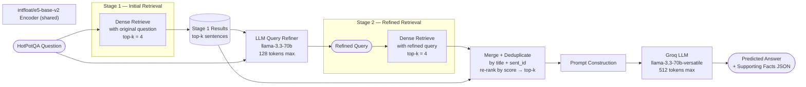

# Pipeline 3 — Multi-Stage RAG (Iterative Dense Retrieval + LLM Query Refinement)

---

## 1. Architecture Diagram



**Two-stage iterative pipeline — LLM bridges the two retrieval passes.**

```
Question ──→ Stage 1: Dense Retrieve ──→ LLM refines query ──→ Stage 2: Dense Retrieve
                                                                       ↓
                                                      Merge + Dedup → top-k → LLM Answer
```

---

## 2. Explanation and Working

### Overview

Multi-Stage RAG introduces **iterative retrieval with LLM-driven query refinement**. After a first-pass dense retrieval, the LLM examines what was found and generates a **refined follow-up query** that targets missing information or related entities not yet covered. A second dense retrieval pass with this refined query is then merged with the first-pass results. The final merged, deduplicated, and re-ranked context is used to generate the answer. Each sample requires **2 LLM calls** (refinement + answer generation) and **2 retrieval calls**.

### Step-by-Step Working

1. **Data Loading**  
   500 HotPotQA `distractor` validation samples, random seed 42.

2. **Context Flattening**  
   Same as other pipelines: candidates = `[{title, sent_id, text}, ...]`.

3. **Stage 1 — Initial Dense Retrieval**  
   The original question (prefixed `"query: "`) is encoded with `intfloat/e5-base-v2`. Candidate sentences (prefixed `"passage: "`) are encoded and stored in a thread-local ChromaDB collection. The top-K=4 sentences by cosine similarity are retrieved.

4. **LLM Query Refinement**  
   The original question + Stage 1 context is fed to the LLM with a compact prompt (max 128 tokens) asking for a single-line refined search query. The refinement prompt instructs the LLM to focus on identifying **missing information** or **related entities**. If the refined query is empty or shorter than 5 characters, the original question is reused as a fallback.

5. **Stage 2 — Refined Dense Retrieval**  
   The refined query is encoded and used to retrieve another top-K=4 sentences from the same candidate pool. Any sentence already retrieved in Stage 1 is skipped (deduplication by `(title, sent_id)` set). New sentences are appended to the accumulated results.

6. **Merge, Dedup, Re-rank**  
   The union of Stage 1 and Stage 2 results is sorted descending by retrieval score. The top-K=4 are selected as the final context.

7. **Final Answer Generation**  
   The final context is formatted into the standard JSON-output prompt and sent to the LLM (max 512 tokens). The response is parsed identically to other pipelines.

8. **Token Accounting**  
   Token usage from both LLM calls (refinement + answer) is summed for the cost proxy.

9. **Parallel Execution**  
   `ThreadPoolExecutor` with workers = API key count. Each worker performs the complete 2-stage pipeline for one sample independently.

---

## 3. Components Used

| Component | Details |
|-----------|---------|
| **Dataset** | HotPotQA `distractor` split, validation set |
| **Samples** | 500 (random seed 42) |
| **Retrieval Method** | Dense neural retrieval (cosine similarity), 2 stages |
| **Embedding Model** | `intfloat/e5-base-v2` — 768-dimensional bi-encoder |
| **Query Prefix** | `"query: "` |
| **Passage Prefix** | `"passage: "` |
| **Embedding Normalisation** | L2 normalisation |
| **Vector Store** | ChromaDB `EphemeralClient`, HNSW, cosine space |
| **Top-K per stage** | 4 retrieved sentences |
| **Number of Stages** | 2 (`N_STAGES = 2`) |
| **LLM (refinement)** | `llama-3.3-70b-versatile` (Groq), max 128 tokens, temperature 0.1 |
| **LLM (answer)** | `llama-3.3-70b-versatile` (Groq), max 512 tokens, temperature 0.1 |
| **LLM calls per sample** | 2 (query refinement + final answer) |
| **Retrieval calls per sample** | 2 (Stage 1 + Stage 2) |
| **Deduplication** | By `(title, sent_id)` set membership |
| **Final context selection** | Top-K by score from merged pool |
| **API Management** | 14-key carousel |
| **Concurrency** | `ThreadPoolExecutor`, workers = API key count |
| **Faithfulness Eval** | RAGAS `Faithfulness` metric |

---

## 4. Evaluation Metrics Considered

| Metric | Category | Description |
|--------|----------|-------------|
| **Answer EM** | Answer Quality | Exact string match (normalised) |
| **Answer F1** | Answer Quality | Token-overlap F1 |
| **SP EM** | Retrieval Quality | Exact set match of supporting fact pairs |
| **SP F1** | Retrieval Quality | F1 over `(title, sent_id)` pairs |
| **SP Precision** | Retrieval Quality | Precision of predicted supporting facts |
| **SP Recall** | Retrieval Quality | Recall of gold supporting facts |
| **Joint EM** | End-to-End | Answer EM × SP EM |
| **Joint F1** | End-to-End | Answer F1 × SP F1 |
| **RAGAS Faithfulness** | Faithfulness | Claims in answer grounded in retrieved context |
| **MRR** | Ranking | Mean Reciprocal Rank of first gold SP retrieved |
| **Latency Mean (s)** | Efficiency | Average per-sample wall-clock time |
| **Latency Median (s)** | Efficiency | Median per-sample wall-clock time |
| **Latency p95 (s)** | Efficiency | 95th-percentile per-sample wall-clock time |
| **Cost Proxy Mean** | Cost | Mean weighted token count per sample |
| **Cost Proxy Total** | Cost | Summed weighted token count |

---

## 5. Formulas

### 5.1 Dense Retrieval (E5 Bi-Encoder)

Passage encoding:
$$\mathbf{v}_p = \text{E5}\left(\text{"passage: "} + p\right) \in \mathbb{R}^{768}$$

Query encoding (Stage 1 uses original question $q$; Stage 2 uses refined query $q'$):
$$\mathbf{v}_q = \text{E5}\left(\text{"query: "} + q\right) \in \mathbb{R}^{768}$$

After L2 normalisation, retrieval selects top-K by cosine similarity:

$$\text{Retrieved}_1 = \text{top-}K\left\{\cos\!\left(\hat{\mathbf{v}}_q,\, \hat{\mathbf{v}}_p\right) : p \in \mathcal{C}\right\}$$

### 5.2 LLM Query Refinement

The refinement function maps the original question and Stage 1 evidence to a refined query:

$$q' = \text{LLM}_{\text{refine}}\!\left(q,\; \text{Retrieved}_1\right)$$

The refinement prompt enforces a single-line output focused on identifying missing information. Fallback:

$$q' = \begin{cases} q' & \text{if } |q'| \geq 5 \\ q & \text{otherwise} \end{cases}$$

### 5.3 Stage 2 Retrieval and Deduplication

$$\text{Retrieved}_2 = \text{top-}K\left\{\cos\!\left(\hat{\mathbf{v}}_{q'},\, \hat{\mathbf{v}}_p\right) : p \in \mathcal{C}\right\}$$

Deduplicated union:

$$\mathcal{R} = \text{Retrieved}_1 \cup \left\{r \in \text{Retrieved}_2 : (r.\text{title}, r.\text{sent\_id}) \notin \text{Retrieved}_1\right\}$$

### 5.4 Final Context Selection

The final context is the top-K sentences by retrieval score from the merged pool:

$$\mathcal{F} = \text{top-}K\left(\mathcal{R},\; \text{key}=\text{score}\right)$$

### 5.5 Cost Proxy (Multi-Call)

Tokens are summed across both LLM calls:

$$\text{Cost Proxy}_i = \left(T^{(1)}_{\text{in}} + T^{(2)}_{\text{in}}\right) + 1.34 \times \left(T^{(1)}_{\text{out}} + T^{(2)}_{\text{out}}\right)$$

where superscripts $(1)$ and $(2)$ refer to the refinement and answer generation calls respectively.

### 5.6 Answer EM

$$\text{EM}(p, g) = \mathbf{1}\left[\hat{p} = \hat{g}\right]$$

### 5.7 Answer F1

$$\text{F1}(p, g) = \frac{2 \cdot |\hat{P} \cap \hat{G}|}{|\hat{P}| + |\hat{G}|}$$

### 5.8 Supporting Facts Metrics

$$\text{SP Precision} = \frac{|\mathcal{P} \cap \mathcal{G}|}{|\mathcal{P}|}, \quad \text{SP Recall} = \frac{|\mathcal{P} \cap \mathcal{G}|}{|\mathcal{G}|}$$

$$\text{SP F1} = \frac{2 \cdot \text{SP Precision} \cdot \text{SP Recall}}{\text{SP Precision} + \text{SP Recall}}, \quad \text{SP EM} = \mathbf{1}\left[\mathcal{P} = \mathcal{G}\right]$$

### 5.9 Joint Metrics

$$\text{Joint EM} = \text{Answer EM} \times \text{SP EM}, \quad \text{Joint F1} = \text{Answer F1} \times \text{SP F1}$$

### 5.10 Mean Reciprocal Rank (MRR)

MRR is computed over the **final merged context** $\mathcal{F}$:

$$\text{MRR} = \frac{1}{N} \sum_{i=1}^{N} \frac{1}{\text{rank}_{i}^{\text{first gold}}}$$

### 5.11 RAGAS Faithfulness

$$\text{Faithfulness} = \frac{|\{c \in \text{claims}(\hat{a}) : c \vDash \mathcal{F}\}|}{|\text{claims}(\hat{a})|}$$
