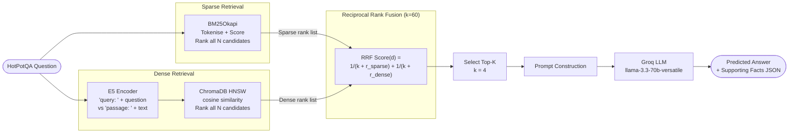

# Pipeline 4 — Hybrid RAG (BM25 + Dense + Reciprocal Rank Fusion)

---

## 1. Architecture Diagram



**Single-pass, two-signal retrieval — fused before the LLM.**

```
              ┌─── BM25 (full rank) ────┐
Question ─────┤                          ├──→ RRF Fusion ──→ top-k ──→ LLM
              └─── Dense (full rank) ────┘
```

---

## 2. Explanation and Working

### Overview

Hybrid RAG combines the complementary strengths of **sparse** (BM25) and **dense** (E5) retrieval by fusing their ranked result lists using **Reciprocal Rank Fusion (RRF)**. BM25 excels at exact keyword matching and is highly effective for named entities and rare terms. Dense retrieval captures semantic relatedness and paraphrase. By fusing both rank lists, Hybrid RAG is more robust than either retriever alone. Both retrievers rank **all** candidate sentences (not just top-K), and RRF combines the rank positions before the top-K final selection.

### Step-by-Step Working

1. **Data Loading**  
   500 HotPotQA `distractor` validation samples, random seed 42.

2. **Context Flattening**  
   Candidates = `[{title, sent_id, text}, ...]` for all sentences in the sample.

3. **Sparse Retrieval — BM25**  
   All $N$ candidate sentences are ranked by BM25 with the original question as query. **Full ranking** is obtained (not truncated to K): all $N$ candidates receive a rank position.

4. **Dense Retrieval — E5 + ChromaDB**  
   The question (prefixed `"query: "`) and all candidate sentences (prefixed `"passage: "`) are encoded by `intfloat/e5-base-v2` and L2-normalised. ChromaDB's HNSW index returns **all $N$ candidates** ranked by cosine distance.

5. **Rank Mapping**  
   Both ranked lists are converted to dictionaries: `{candidate_index: rank_position (1-indexed)}`. Candidates absent from a rank list (which should not occur since all are ranked) are assigned a penalty rank of $N+1$.

6. **Reciprocal Rank Fusion**  
   For each candidate $d$ (indexed $i$):
   $$\text{RRF}(i) = \frac{1}{k + r_{\text{BM25}}(i)} + \frac{1}{k + r_{\text{Dense}}(i)}$$
   where $k=60$ (the standard RRF smoothing constant).

7. **Top-K Selection**  
   Candidates are sorted descending by RRF score. The top-K=4 form the final context.

8. **Prompt, LLM, Evaluation**  
   Identical to other pipelines: structured JSON prompt → Groq LLM → parse → evaluate.

9. **Parallel Execution**  
   `ThreadPoolExecutor` with 14 workers.

---

## 3. Components Used

| Component | Details |
|-----------|---------|
| **Dataset** | HotPotQA `distractor` split, validation set |
| **Samples** | 500 (random seed 42) |
| **Sparse Retriever** | BM25Okapi (`rank-bm25`), full ranking of all candidates |
| **Dense Retriever** | `intfloat/e5-base-v2` + ChromaDB HNSW (cosine), full ranking |
| **Fusion Method** | Reciprocal Rank Fusion (RRF) |
| **RRF k constant** | 60 |
| **Top-K (final)** | 4 sentences after RRF |
| **LLM** | `llama-3.3-70b-versatile` (Groq), temperature 0.1, max 512 tokens |
| **LLM calls per sample** | 1 |
| **Retrieval calls per sample** | 1 (BM25 + Dense run simultaneously, counted as 1) |
| **API Management** | 14-key carousel |
| **Concurrency** | `ThreadPoolExecutor`, 14 workers |
| **Faithfulness Eval** | RAGAS `Faithfulness` metric |

---

## 4. Evaluation Metrics Considered

| Metric | Category | Description |
|--------|----------|-------------|
| **Answer EM** | Answer Quality | Exact string match (normalised) |
| **Answer F1** | Answer Quality | Token-overlap F1 |
| **SP EM** | Retrieval Quality | Exact set match of supporting fact pairs |
| **SP F1** | Retrieval Quality | F1 over `(title, sent_id)` pairs |
| **SP Precision** | Retrieval Quality | Precision of predicted supporting facts |
| **SP Recall** | Retrieval Quality | Recall of gold supporting facts |
| **Joint EM** | End-to-End | Answer EM × SP EM |
| **Joint F1** | End-to-End | Answer F1 × SP F1 |
| **RAGAS Faithfulness** | Faithfulness | Claims in answer grounded in retrieved context |
| **MRR** | Ranking | Mean Reciprocal Rank of first gold SP retrieved |
| **Latency Mean (s)** | Efficiency | Average per-sample wall-clock time |
| **Latency Median (s)** | Efficiency | Median per-sample wall-clock time |
| **Latency p95 (s)** | Efficiency | 95th-percentile per-sample wall-clock time |
| **Cost Proxy Mean** | Cost | Mean weighted token count per sample |
| **Cost Proxy Total** | Cost | Summed weighted token count |

---

## 5. Formulas

### 5.1 BM25 Scoring (Sparse Signal)

$$\text{BM25}(d, Q) = \sum_{i=1}^{n} \text{IDF}(q_i) \cdot \frac{f(q_i, d) \cdot (k_1 + 1)}{f(q_i, d) + k_1 \cdot \left(1 - b + b \cdot \frac{|d|}{\text{avgdl}}\right)}$$

- $k_1 = 1.5$, $b = 0.75$ (BM25Okapi defaults)
- $\text{IDF}(q_i) = \log\!\left(\dfrac{N - n(q_i) + 0.5}{n(q_i) + 0.5} + 1\right)$

### 5.2 E5 Cosine Similarity (Dense Signal)

$$\text{sim}(\mathbf{v}_q, \mathbf{v}_p) = \hat{\mathbf{v}}_q^\top \hat{\mathbf{v}}_p$$

where $\hat{\mathbf{v}} = \mathbf{v} / \|\mathbf{v}\|_2$.

### 5.3 Rank Conversion

Both scorers produce a full ranking $r: \mathcal{C} \to \{1, 2, \ldots, N\}$:

$$r_{\text{BM25}}(i) = \text{rank of candidate } i \text{ in BM25 sorted list}$$
$$r_{\text{Dense}}(i) = \text{rank of candidate } i \text{ in cosine-similarity sorted list}$$

Missing candidates (penalty): $r(i) = N + 1$.

### 5.4 Reciprocal Rank Fusion (RRF)

The **2-way RRF** fuses two rank lists with smoothing constant $k$:

$$\text{RRF}(i) = \frac{1}{k + r_{\text{BM25}}(i)} + \frac{1}{k + r_{\text{Dense}}(i)}$$

where $k = 60$ is the standard value from Cormack et al. (2009). Higher $k$ reduces the sensitivity to top-ranked differences; $k=60$ ensures robust, rank-position-resistant fusion.

**Final context selection:**

$$\mathcal{F} = \text{top-}K\!\left(\mathcal{C},\; \text{key} = \text{RRF}(i)\right)$$

### 5.5 Properties of RRF

- **Rank-position invariant:** Only ranks matter, not raw scores from different systems.
- **No calibration needed:** Scores from BM25 and cosine similarity are not directly comparable; rank fusion avoids this.
- **Additive:** Each retrieval system contributes independently; systems cannot cancel each other.

### 5.6 Answer EM

$$\text{EM}(p, g) = \mathbf{1}\left[\hat{p} = \hat{g}\right]$$

### 5.7 Answer F1

$$\text{F1}(p, g) = \frac{2 \cdot |\hat{P} \cap \hat{G}|}{|\hat{P}| + |\hat{G}|}$$

### 5.8 Supporting Facts Metrics

$$\text{SP Precision} = \frac{|\mathcal{P} \cap \mathcal{G}|}{|\mathcal{P}|}, \quad \text{SP Recall} = \frac{|\mathcal{P} \cap \mathcal{G}|}{|\mathcal{G}|}$$

$$\text{SP F1} = \frac{2 \cdot \text{SP Precision} \cdot \text{SP Recall}}{\text{SP Precision} + \text{SP Recall}}, \quad \text{SP EM} = \mathbf{1}\left[\mathcal{P} = \mathcal{G}\right]$$

### 5.9 Joint Metrics

$$\text{Joint EM} = \text{Answer EM} \times \text{SP EM}, \quad \text{Joint F1} = \text{Answer F1} \times \text{SP F1}$$

### 5.10 Mean Reciprocal Rank (MRR)

$$\text{MRR} = \frac{1}{N} \sum_{i=1}^{N} \frac{1}{\text{rank}_{i}^{\text{first gold}}}$$

### 5.11 Cost Proxy

$$\text{Cost Proxy}_i = T_{\text{input},i} + 1.34 \times T_{\text{output},i}$$

### 5.12 RAGAS Faithfulness

$$\text{Faithfulness} = \frac{|\{c \in \text{claims}(\hat{a}) : c \vDash \mathcal{F}\}|}{|\text{claims}(\hat{a})|}$$
