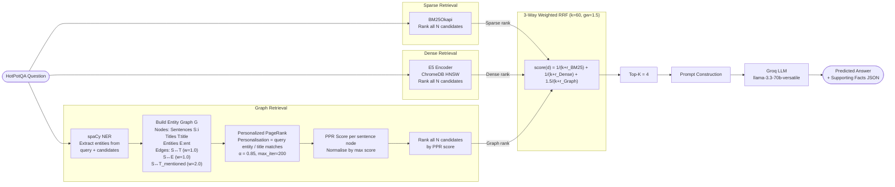

# Pipeline 5 — Graph-Enhanced Hybrid RAG (BM25 + Dense + Entity Graph + 3-Way RRF)

---

## 1. Architecture Diagram



**Single-pass, three-signal retrieval with graph reasoning.**

```
              ┌─── BM25 ─────────────────┐
Question ─────┼─── Dense ────────────────┼──→ 3-Way Weighted RRF ──→ top-k ──→ LLM
              └─── Graph PPR (NER+PPR) ──┘      gw = 1.5
```

---

## 2. Explanation and Working

### Overview

Graph-Enhanced Hybrid RAG extends Pipeline 4 by adding a **third retrieval signal**: a **per-query entity relationship graph** with **Personalized PageRank (PPR)**. The key insight for HotPotQA is that multi-hop questions require traversing two or more knowledge bridges — e.g., "Which film was directed by the person born in X?" requires first finding who was born in X, then finding their films. The graph component explicitly models these **cross-paragraph relationships** by:

1. Detecting named entities in each sentence using spaCy NER.
2. Building a heterogeneous graph connecting sentence nodes, title nodes, and entity nodes.
3. Giving high edge weight to **cross-paragraph title mentions** (bridge signal).
4. Running PPR seeded from query-matching entities/titles, propagating importance through the graph to bridge paragraphs.

The PPR-ranked signal is fused with BM25 and dense ranks via **3-way weighted RRF**, with the graph signal receiving a boost weight of 1.5 to amplify the multi-hop bridge discovery.

### Step-by-Step Working

1. **Data Loading**  
   500 HotPotQA `distractor` validation samples, random seed 42.

2. **Context Flattening**  
   Candidates = `[{title, sent_id, text}, ...]`.

3. **Sparse Retrieval — BM25**  
   Full ranking of all $N$ candidates.

4. **Dense Retrieval — E5 + ChromaDB**  
   Full cosine-similarity ranking of all $N$ candidates.

5. **Graph Construction (per query)**

   a. **NER**: spaCy `en_core_web_sm` (NER only, no parser/lemmatizer) extracts entities from each candidate sentence and from the query.

   b. **Node types:**
   - `T:title` — one node per unique paragraph title
   - `S:i` — one node per sentence (indexed by candidate position)
   - `E:entity` — one node per unique named entity string (lower-cased)

   c. **Edge types and weights:**
   - `S:i ↔ T:title` — connects sentence to its paragraph title (weight 1.0)
   - `S:i ↔ E:entity` — connects sentence to each entity it contains (weight 1.0)
   - `S:i ↔ T:other_title` — cross-paragraph bridge: if sentence $i$ contains the text of another paragraph's title, a high-weight edge (weight **2.0**) is added. This is the core multi-hop bridge signal.

6. **Personalized PageRank (PPR)**  
   The personalisation vector seeds the PPR at:
   - Entity nodes `E:ent` where `ent` appears in the query (weight 1.0)
   - Title nodes `T:title` where the title appears in the query (weight 2.0)
   - Fallback (if no entities/titles match): title nodes with word-overlap with the query
   
   PPR is run with $\alpha = 0.85$ and up to 200 iterations. Sentence node scores are extracted, normalised by the maximum, and used to rank candidates.

7. **3-Way Weighted RRF**  
   For each candidate $i$:
   $$\text{score}(i) = \frac{1}{k + r_{\text{BM25}}(i)} + \frac{1}{k + r_{\text{Dense}}(i)} + 1.5 \cdot \frac{1}{k + r_{\text{Graph}}(i)}$$
   where $k=60$ and the graph weight $= 1.5$.

8. **Top-K Selection → Prompt → LLM**  
   Top-4 by RRF score → structured prompt → Groq LLM → JSON parse.

9. **Parallel Execution**  
   ThreadPoolExecutor, workers = API key count. The spaCy model uses a shared lock (`_nlp_lock`) for thread safety; ChromaDB uses `_chroma_lock`.

---

## 3. Components Used

| Component | Details |
|-----------|---------|
| **Dataset** | HotPotQA `distractor` split, validation set |
| **Samples** | 500 (random seed 42) |
| **Sparse Retriever** | BM25Okapi (`rank-bm25`) |
| **Dense Retriever** | `intfloat/e5-base-v2` + ChromaDB HNSW |
| **Graph Retriever** | Custom entity graph + Personalized PageRank |
| **NER Model** | spaCy `en_core_web_sm` (NER-only, no parser/lemmatizer) |
| **Graph Library** | NetworkX |
| **Graph Type** | Undirected heterogeneous (sentence, title, entity nodes) |
| **Cross-paragraph Edge Weight** | 2.0 (bridge signal) |
| **Normal Edge Weight** | 1.0 |
| **PPR Damping Factor** | α = 0.85 |
| **PPR Max Iterations** | 200 |
| **Fusion Method** | 3-way weighted RRF |
| **RRF k constant** | 60 |
| **Graph Signal Weight** | 1.5 |
| **Top-K (final)** | 4 |
| **LLM** | `llama-3.3-70b-versatile` (Groq), temperature 0.1, max 512 tokens |
| **LLM calls per sample** | 1 |
| **API Management** | 14-key carousel, MAX_WORKERS auto-scaled |
| **Faithfulness Eval** | RAGAS `Faithfulness` metric |

---

## 4. Evaluation Metrics Considered

| Metric | Category | Description |
|--------|----------|-------------|
| **Answer EM** | Answer Quality | Exact string match (normalised) |
| **Answer F1** | Answer Quality | Token-overlap F1 |
| **SP EM** | Retrieval Quality | Exact set match of supporting fact pairs |
| **SP F1** | Retrieval Quality | F1 over `(title, sent_id)` pairs |
| **SP Precision** | Retrieval Quality | Precision of predicted supporting facts |
| **SP Recall** | Retrieval Quality | Recall of gold supporting facts |
| **Joint EM** | End-to-End | Answer EM × SP EM |
| **Joint F1** | End-to-End | Answer F1 × SP F1 |
| **RAGAS Faithfulness** | Faithfulness | Claims in answer grounded in retrieved context |
| **MRR** | Ranking | Mean Reciprocal Rank of first gold SP retrieved |
| **Latency Mean (s)** | Efficiency | Average per-sample wall-clock time |
| **Latency Median (s)** | Efficiency | Median per-sample wall-clock time |
| **Latency p95 (s)** | Efficiency | 95th-percentile per-sample wall-clock time |
| **Cost Proxy Mean** | Cost | Mean weighted token count per sample |
| **Cost Proxy Total** | Cost | Summed weighted token count |

---

## 5. Formulas

### 5.1 Graph Construction

The heterogeneous graph $G = (V, E)$ is constructed per-query with:

$$V = \{S_i\}_{i=0}^{N-1} \cup \{T_j\}_{j} \cup \{E_k\}_{k}$$

$$E = \underbrace{\{(S_i, T_{j(i)}, w=1.0)\}}_{\text{sentence–title}} \cup \underbrace{\{(S_i, E_k, w=1.0) : e_k \in \text{ents}(S_i)\}}_{\text{sentence–entity}} \cup \underbrace{\{(S_i, T_j, w=2.0) : \text{title}_j \in \text{text}(S_i),\; j \neq j(i)\}}_{\text{cross-paragraph bridge}}$$

### 5.2 Personalization Vector

$$p(v) = \begin{cases}
1.0 & \text{if } v = E_k \text{ and } e_k \in \text{ents}(q) \\
2.0 & \text{if } v = T_j \text{ and } \text{title}_j \in q \\
0.0 & \text{otherwise}
\end{cases}$$

After fallback normalisation: $\tilde{p}(v) = p(v) / \sum_{v'} p(v')$.

### 5.3 Personalized PageRank

The PPR vector $\pi$ satisfies:

$$\pi = \alpha \cdot \mathbf{W}^\top \pi + (1 - \alpha) \cdot \tilde{\mathbf{p}}$$

where $\mathbf{W}$ is the (row-normalised by node degree) transition matrix from $G$, and $\alpha = 0.85$. Solved iteratively (power iteration, max 200 steps) via `networkx.pagerank`.

The PPR score for sentence $i$ is:

$$\text{PPR}(i) = \pi(S_i)$$

Normalised:

$$\hat{\text{PPR}}(i) = \frac{\text{PPR}(i)}{\max_j \text{PPR}(j)}$$

### 5.4 Graph Rank

$$r_{\text{Graph}}(i) = \text{rank of } i \text{ in descending order of } \hat{\text{PPR}}(i)$$

### 5.5 Three-Way Weighted RRF

$$\text{score}(i) = \frac{1}{k + r_{\text{BM25}}(i)} + \frac{1}{k + r_{\text{Dense}}(i)} + w_g \cdot \frac{1}{k + r_{\text{Graph}}(i)}$$

where $k = 60$ and $w_g = 1.5$.

The graph weight $w_g > 1$ amplifies the multi-hop bridging signal. Increasing $w_g$ biases the fusion towards graph evidence; the value 1.5 was chosen to give graph a moderate but decisive advantage for bridge sentences.

**Final selection:**

$$\mathcal{F} = \text{top-}K\!\left(\mathcal{C},\; \text{key} = \text{score}(i)\right)$$

### 5.6 Answer EM

$$\text{EM}(p, g) = \mathbf{1}\left[\hat{p} = \hat{g}\right]$$

### 5.7 Answer F1

$$\text{F1}(p, g) = \frac{2 \cdot |\hat{P} \cap \hat{G}|}{|\hat{P}| + |\hat{G}|}$$

### 5.8 Supporting Facts Metrics

$$\text{SP Precision} = \frac{|\mathcal{P} \cap \mathcal{G}|}{|\mathcal{P}|}, \quad \text{SP Recall} = \frac{|\mathcal{P} \cap \mathcal{G}|}{|\mathcal{G}|}$$

$$\text{SP F1} = \frac{2 \cdot \text{SP Precision} \cdot \text{SP Recall}}{\text{SP Precision} + \text{SP Recall}}, \quad \text{SP EM} = \mathbf{1}\left[\mathcal{P} = \mathcal{G}\right]$$

### 5.9 Joint Metrics

$$\text{Joint EM} = \text{Answer EM} \times \text{SP EM}, \quad \text{Joint F1} = \text{Answer F1} \times \text{SP F1}$$

### 5.10 Mean Reciprocal Rank (MRR)

$$\text{MRR} = \frac{1}{N} \sum_{i=1}^{N} \frac{1}{\text{rank}_{i}^{\text{first gold}}}$$

### 5.11 Cost Proxy

$$\text{Cost Proxy}_i = T_{\text{input},i} + 1.34 \times T_{\text{output},i}$$

### 5.12 RAGAS Faithfulness

$$\text{Faithfulness} = \frac{|\{c \in \text{claims}(\hat{a}) : c \vDash \mathcal{F}\}|}{|\text{claims}(\hat{a})|}$$
