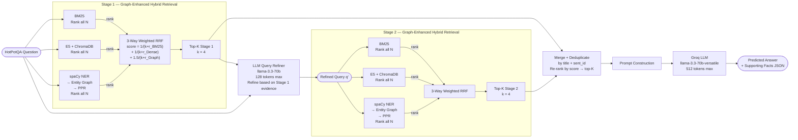

# Pipeline 6 — Multi-Stage Graph-Enhanced Hybrid RAG

---

## 1. Architecture Diagram



**Two-stage pipeline combining graph-enhanced hybrid retrieval with LLM query refinement.**

```
Stage 1: BM25 + Dense + GraphPPR → 3-Way RRF → top-k → LLM Refine
Stage 2: BM25 + Dense + GraphPPR → 3-Way RRF → top-k → Merge → LLM Answer
```

---

## 2. Explanation and Working

### Overview

Multi-Stage Graph-Enhanced Hybrid RAG is the **most sophisticated pipeline** in this study. It combines every retrieval strategy developed across the previous pipelines:

- **Sparse retrieval** (BM25) for keyword precision  
- **Dense retrieval** (E5 + ChromaDB) for semantic understanding  
- **Graph-based retrieval** (NER + entity graph + PPR) for multi-hop bridge discovery  
- **Query refinement** (LLM) to correct evidence gaps between stages  
- **Iterative retrieval** (2 stages) for progressive context accumulation  

Each sample requires **3 LLM calls** (Stage 1 refinement + Stage 2 answer generation can have an additional optional call in extended variants, but here: 1 refinement call + 1 answer call = 2 LLM calls) and **6 retrieval sub-calls** (BM25 + Dense + Graph × 2 stages, counted as **2 retrieval_calls** in the implementation).

### Step-by-Step Working

1. **Data Loading**  
   500 HotPotQA `distractor` validation samples, random seed 42.

2. **Context Flattening**  
   Candidates = `[{title, sent_id, text}, ...]` for all sentences.

3. **Stage 1 — Graph-Enhanced Hybrid Retrieval**

   a. **BM25**: Full ranking of all $N$ candidates.  
   b. **Dense (E5 + ChromaDB)**: Full cosine-similarity ranking.  
   c. **Graph (NER + PPR)**:  
      - spaCy extracts entities from the query and all candidate sentences.  
      - An entity graph $G$ is constructed with sentence, title, and entity nodes.  
      - Cross-paragraph title mentions (bridge edges) receive weight 2.0.  
      - Personalized PageRank ($\alpha = 0.85$) is seeded at query-matching entities/titles.  
      - Sentence PPR scores are normalised and used for ranking.  
   d. **3-Way Weighted RRF**: Ranks from all three retrievers are fused:
      $$\text{score}_1(i) = \frac{1}{k + r_{\text{BM25}}} + \frac{1}{k + r_{\text{Dense}}} + 1.5 \cdot \frac{1}{k + r_{\text{Graph}}}$$
   e. **Top-K=4** selected.

4. **LLM Query Refinement**  
   The original question + Stage 1 context is passed to the LLM (max 128 tokens). The LLM generates a single-line refined query targeting missing information or unresolved entities. Fallback to the original question if the refined query is too short.

5. **Stage 2 — Graph-Enhanced Hybrid Retrieval with Refined Query**  
   The entire 3-way graph-enhanced hybrid retrieval is repeated identically, but using the **refined query** $q'$ instead of the original question $q$. This includes re-running BM25, dense, and graph retrieval (the graph is rebuilt with query entities from $q'$). Top-K=4 selected.

6. **Merge and Deduplicate**  
   Stage 1 and Stage 2 results are merged. Sentences already in Stage 1 are not duplicated. The union is re-ranked by retrieval score; top-K=4 is the final context.

7. **Final Answer Generation**  
   The final merged context → structured JSON prompt → Groq LLM (max 512 tokens) → JSON parse.

8. **Token Accounting**  
   Token usage from both LLM calls (refinement + answer generation) is accumulated.

9. **Parallel Execution**  
   `ThreadPoolExecutor`, workers = API key count. All graph construction and retrieval per sample is independent, enabling full parallelism.

---

## 3. Components Used

| Component | Details |
|-----------|---------|
| **Dataset** | HotPotQA `distractor` split, validation set |
| **Samples** | 500 (random seed 42) |
| **Sparse Retriever** | BM25Okapi (`rank-bm25`), full ranking |
| **Dense Retriever** | `intfloat/e5-base-v2` + ChromaDB HNSW (cosine), full ranking |
| **Graph Retriever** | Custom entity graph + Personalized PageRank (per stage) |
| **NER Model** | spaCy `en_core_web_sm` (NER-only) |
| **Graph Library** | NetworkX |
| **Graph Type** | Undirected heterogeneous |
| **Cross-paragraph Edge Weight** | 2.0 |
| **Normal Edge Weight** | 1.0 |
| **PPR Damping Factor** | α = 0.85 |
| **PPR Max Iterations** | 200 |
| **Fusion Method** | 3-way weighted RRF (per stage) |
| **RRF k constant** | 60 |
| **Graph Signal Weight** | 1.5 |
| **Top-K per stage** | 4 |
| **Number of Stages** | 2 |
| **LLM (refinement)** | `llama-3.3-70b-versatile` (Groq), max 128 tokens |
| **LLM (answer)** | `llama-3.3-70b-versatile` (Groq), max 512 tokens |
| **LLM calls per sample** | 2 (refinement + answer) |
| **Retrieval calls per sample** | 2 (Stage 1 + Stage 2, each = 3 sub-retrievers) |
| **Deduplication** | By `(title, sent_id)` set |
| **API Management** | 14-key carousel, MAX_WORKERS auto-scaled |
| **Faithfulness Eval** | RAGAS `Faithfulness` metric |

---

## 4. Evaluation Metrics Considered

| Metric | Category | Description |
|--------|----------|-------------|
| **Answer EM** | Answer Quality | Exact string match (normalised) |
| **Answer F1** | Answer Quality | Token-overlap F1 |
| **SP EM** | Retrieval Quality | Exact set match of supporting fact pairs |
| **SP F1** | Retrieval Quality | F1 over `(title, sent_id)` pairs |
| **SP Precision** | Retrieval Quality | Precision of predicted supporting facts |
| **SP Recall** | Retrieval Quality | Recall of gold supporting facts |
| **Joint EM** | End-to-End | Answer EM × SP EM |
| **Joint F1** | End-to-End | Answer F1 × SP F1 |
| **RAGAS Faithfulness** | Faithfulness | Claims in answer grounded in retrieved context |
| **MRR** | Ranking | Mean Reciprocal Rank of first gold SP retrieved |
| **Latency Mean (s)** | Efficiency | Average per-sample wall-clock time |
| **Latency Median (s)** | Efficiency | Median per-sample wall-clock time |
| **Latency p95 (s)** | Efficiency | 95th-percentile per-sample wall-clock time |
| **Cost Proxy Mean** | Cost | Mean weighted token count per sample |
| **Cost Proxy Total** | Cost | Summed weighted token count |

---

## 5. Formulas

### 5.1 Graph Construction (identical per stage, query changes in Stage 2)

$$V = \{S_i\} \cup \{T_j\} \cup \{E_k\}$$

$$E = \{(S_i, T_{j(i)}, 1.0)\} \cup \{(S_i, E_k, 1.0) : e_k \in \text{ents}(S_i)\} \cup \{(S_i, T_j, 2.0) : \text{title}_j \in \text{text}(S_i),\; j \neq j(i)\}$$

### 5.2 Personalization Vector

For Stage 1 (query $q$):
$$\tilde{p}^{(1)}(v) \propto \begin{cases} 1.0 & v = E_k,\; e_k \in \text{ents}(q) \\ 2.0 & v = T_j,\; \text{title}_j \in q \end{cases}$$

For Stage 2 (refined query $q'$):
$$\tilde{p}^{(2)}(v) \propto \begin{cases} 1.0 & v = E_k,\; e_k \in \text{ents}(q') \\ 2.0 & v = T_j,\; \text{title}_j \in q' \end{cases}$$

### 5.3 Personalized PageRank (per stage)

$$\pi^{(s)} = \alpha \cdot \mathbf{W}^\top \pi^{(s)} + (1-\alpha) \cdot \tilde{\mathbf{p}}^{(s)}, \quad \alpha = 0.85$$

$$\hat{\text{PPR}}^{(s)}(i) = \frac{\pi^{(s)}(S_i)}{\max_j \pi^{(s)}(S_j)}$$

### 5.4 Three-Way Weighted RRF (per stage)

$$\text{score}^{(s)}(i) = \frac{1}{k + r^{(s)}_{\text{BM25}}(i)} + \frac{1}{k + r^{(s)}_{\text{Dense}}(i)} + w_g \cdot \frac{1}{k + r^{(s)}_{\text{Graph}}(i)}$$

where $k = 60$ and $w_g = 1.5$ for both stages.

### 5.5 Stage 1 Top-K Selection

$$\text{Retrieved}^{(1)} = \text{top-}K\!\left(\mathcal{C},\; \text{key} = \text{score}^{(1)}(i)\right)$$

### 5.6 LLM Query Refinement

$$q' = \text{LLM}_{\text{refine}}\!\left(q,\; \text{Retrieved}^{(1)}\right)$$

Fallback: $q' \leftarrow q$ if $|q'| < 5$.

### 5.7 Stage 2 Top-K Selection

$$\text{Retrieved}^{(2)} = \text{top-}K\!\left(\mathcal{C},\; \text{key} = \text{score}^{(2)}(i)\right)$$

The Stage 2 graph uses query entities from $q'$, so the PPR personalisation vector differs from Stage 1.

### 5.8 Merge and Deduplication

$$\mathcal{R} = \text{Retrieved}^{(1)} \cup \left\{r \in \text{Retrieved}^{(2)} : (r.\text{title}, r.\text{sent\_id}) \notin \text{Retrieved}^{(1)}\right\}$$

### 5.9 Final Context

$$\mathcal{F} = \text{top-}K\!\left(\mathcal{R},\; \text{key} = \text{score}\right)$$

### 5.10 Cost Proxy (Multi-Call)

$$\text{Cost Proxy}_i = \left(T^{(1)}_{\text{in}} + T^{(2)}_{\text{in}}\right) + 1.34 \times \left(T^{(1)}_{\text{out}} + T^{(2)}_{\text{out}}\right)$$

where superscripts denote the refinement (1) and answer (2) LLM calls.

### 5.11 Answer EM

$$\text{EM}(p, g) = \mathbf{1}\left[\hat{p} = \hat{g}\right]$$

### 5.12 Answer F1

$$\text{F1}(p, g) = \frac{2 \cdot |\hat{P} \cap \hat{G}|}{|\hat{P}| + |\hat{G}|}$$

### 5.13 Supporting Facts Metrics

$$\text{SP Precision} = \frac{|\mathcal{P} \cap \mathcal{G}|}{|\mathcal{P}|}, \quad \text{SP Recall} = \frac{|\mathcal{P} \cap \mathcal{G}|}{|\mathcal{G}|}$$

$$\text{SP F1} = \frac{2 \cdot \text{SP Precision} \cdot \text{SP Recall}}{\text{SP Precision} + \text{SP Recall}}, \quad \text{SP EM} = \mathbf{1}\left[\mathcal{P} = \mathcal{G}\right]$$

### 5.14 Joint Metrics

$$\text{Joint EM} = \text{Answer EM} \times \text{SP EM}, \quad \text{Joint F1} = \text{Answer F1} \times \text{SP F1}$$

### 5.15 Mean Reciprocal Rank (MRR)

$$\text{MRR} = \frac{1}{N} \sum_{i=1}^{N} \frac{1}{\text{rank}_{i}^{\text{first gold}}}$$

MRR is computed over the **final merged context** $\mathcal{F}$.

### 5.16 RAGAS Faithfulness

$$\text{Faithfulness} = \frac{|\{c \in \text{claims}(\hat{a}) : c \vDash \mathcal{F}\}|}{|\text{claims}(\hat{a})|}$$
